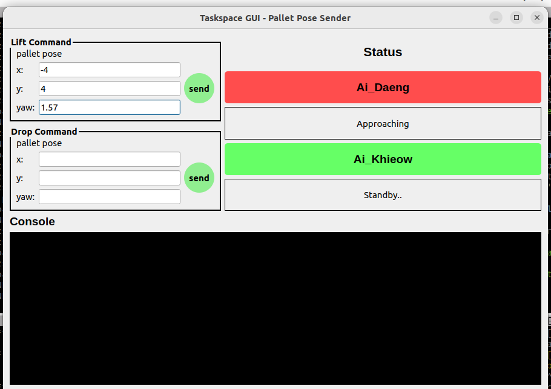

# Collaborative-TwinFork-Robot-Simulation


TwinFork Robot คือหุ่นยนต์ประเภทฟอร์กลิฟต์ที่มีลักษณะเป็น "ส้อมคู่" สองแท่ง ซึ่งทำงานร่วมกันในการขนย้ายพาเลต ในโปรเจคนี้ เราได้ทดลองออกแบบระบบควบคุม การทำงานแบบประสานกันของหุ่นยนต์ และทำการจำลองในโปรแกรม Gazebo Classic

## system diagram


## state-machine
คำสั่งจาก high level มี อยู่ทั้งหมด 2 คำสั่ง คือ 
 1. lift เป็นคำสั่งเพื่อให้ twinfork เข้าไปยก pallet 
 2. drop เป็นคำสั่งให้ twinfork นำ pallet ไปวางตำแหน่งที่ระบุไว้

## pre requiresite

สร้าง workspace และ clone
```
mkdir -p ~/6509_ws/src
cd ~/6509_ws/src/
git clone https://github.com/ChayaninNapia/Collaborative-TwinFork-Robot-Simulation.git
cd ~/6509_ws
colcon build
source install/setup.bash
```
## Run the GUI

```
cd ~/6509_ws
source install/setup.bash
ros2 run twinfork_controller taskspace_server.py 
```

## Launch the Simulation
เปิด termianl ขึ้นมาอีก หน้าแล้วรันคำสั่ง
```
cd ~/6509_ws
source install/setup.bash
ros2 launch twinfork_gazebo multi_sim.launch.py 
```

note: ถ้ารันแล้ว controller fail หรือ frame ปรากฏ ใน Rviz ไม่ตรงกับภาพตัวอย่าง ให้ทำการ kill procress แล้ว รันอีกครั้ง 

```
killall -9 gzserver gzclient
```


ถ้ามีข้อความว่า activated controller ได้แล้ว 2 ครั้งแบบนี้ แสดงว่าใช้งานได้แล้ว


## Let's Test

1. ให้ไปที่เมนู insert ของ gazebo ในรายการให้หา path ที่ถูก add ใน project ชื่อ prefix จะขึ้นอยู่กับ ชื่อ user ของผู้ใช้ ตามภาพตัวอย่างก็คือตรงไฮไลท์สีส้ม 


2. ให้กดที่ euro pallet เพื่อ spawn pallet ขึ้นมา คลิกซ้าย ที่ pallet แล้วจะมี เมนูทางแถบด้านข้างขึ้นมา ให้ไปที่ pose เพื่อเลือก pose ที่เราต้องการ x y yaw


3. ไปที่ taskserver gui แล้วนำ pose ที่ตั้งไว้ใส่ไปใน lift command แล้วกด send 



4. รอจนกว่าหุ่นจะไปถึง แล้วอยู่ใน สถานะ Lifting ทั้งคู่ จากนั้นใส่ ตำแหน่งที่เราต้องการจะย้ายไปที่ Drop command


เมื่อ หุ่นวาง pallet เสร็จแล้ว จะเข้าสู่สถานะ backing off ไปตั้งหลักเข้าสู่โหมด idle เพื่อ รอคำสั่งใหม่อีกครั้ง
